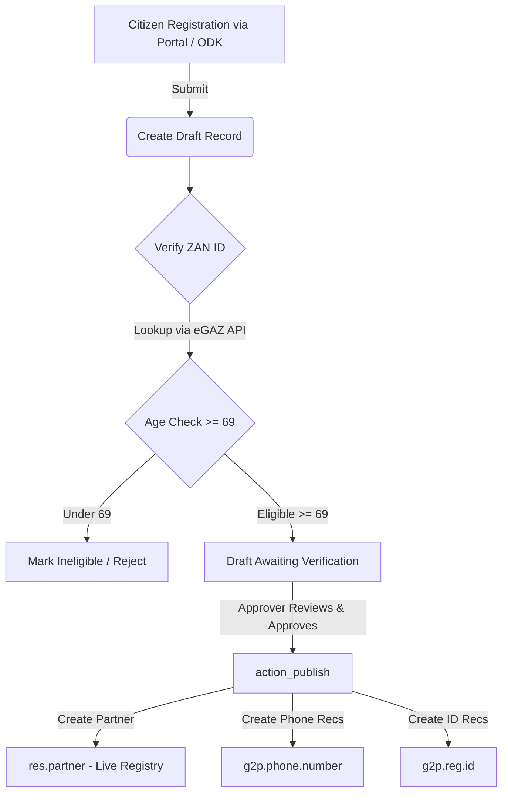

# OpenG2P Zanzibar Custom Addons: Technical Documentation

This repository contains custom Odoo 17 modules developed specifically for the OpenG2P Zanzibar deployment (Zanzibar Universal Pension Scheme - ZUPS). These modules customize Odoo's Social Registry, portal registration workflows, access controls, audit logs, map visualizers, and visual themes to align with Zanzibar-specific requirements.

---

## 1. System Architecture & Registration Workflow

The OpenG2P Zanzibar deployment uses a multi-tier registration flow designed to validate beneficiary eligibility before they are written to the live partner registry.



1. **Ingestion & Draft Creation**: Beneficiaries are submitted through the web portal or imported. They are initially written to the `draft.record` model.
2. **eGAZ Validation & Age Check**: During input, the portal performs a real-time validation of the citizen's Zanzibar ID (Zan ID) against the external eGAZ API. The platform enforces an age threshold of **69+ years old** for ZUPS scheme eligibility.
3. **Draft States**: A draft record moves through `draft` $\rightarrow$ `rejected` or `approved` $\rightarrow$ `published`.
4. **Publishing**: When approved, the draft data (stored inside a JSON blob) is parsed, validated against the Odoo `res.partner` schema, and written as a new registrant in the live registry. Relational records for Zanzibar IDs and phone numbers are created concurrently.

---

## 2. Module Directory

The custom addons are structured into 20 modules, grouped below by function.

### A. Registry & Custom Fields Extension Modules

These modules extend the core Odoo partner database (`res.partner`) with fields required for Zanzibar social registry profiling.

#### 1. `social_registry_custom_fields`
*   **Description**: Adds basic personal, geographical, and registration flags to the beneficiary database.
*   **Dependencies**: `g2p_social_registry`, `g2p_registry_individual`, `g2p_draft_publish`
*   **Key Models & Fields**:
    *   `res.partner` (Inherits):
        *   `benf_zan_id` (`Char`): Zanzibar ID, computed and stored.
        *   `pensioner_id` (`Char`): Unique identifier for ZUPS.
        *   `middle_name` (`Char`): Middle name.
        *   `benf_post_code` (`Char`): Post office box / code.
        *   `disability` (`Selection`): Selection for disability status.
        *   `is_receiving_allowance` (`Selection`): Indication if the person receives another allowance.
        *   `has_health_insurance` (`Selection`): Indication if the person holds health insurance.
        *   `x_region_code` / `x_district_code` (`Char`): Temporary code storage fields for legacy imports.

#### 2. `relative_nominee`
*   **Description**: Manages information for nominees, relatives, and helpers assigned to assist the beneficiary.
*   **Dependencies**: `g2p_registry_individual`
*   **Key Models & Fields**:
    *   `res.partner` (Inherits):
        *   `nominee_first_name`, `nominee_middle_name`, `nominee_last_name` (`Char`)
        *   `nominee_gender` (`Selection`)
        *   `nominee_mobile` (`Char`)
        *   `nominee_zanid` (`Char`): Nominee's Zanzibar ID.
        *   `nominee_rel_benf` (`Selection`): Relationship to beneficiary (e.g., child, spouse, neighbor).
        *   `nominee_house_street`, `nominee_shehia`, `nominee_post_code` (`Char`): Nominee address fields.
        *   `nominee_region`, `nominee_district` (`Selection`): Geolocation selectors.
        *   `beneficiary_phone_number_ids`, `nominee_phone_number_ids` (`One2many`): Multi-phone number tracking.
    *   `g2p.phone.number` (Inherits):
        *   `phone_owner` (`Selection`): Identifies if the phone belongs to the `beneficiary`, `nominee`, or `other`.

#### 3. `payment_method`
*   **Description**: Adds fields to register beneficiary bank details or mobile money wallets.
*   **Dependencies**: `g2p_registry_individual`
*   **Key Models & Fields**:
    *   `res.partner` (Inherits):
        *   `payment_mode` (`Selection`): Mobile Wallet, Bank, or Cash.
        *   `bank_name` (`Char`)
        *   `account_num` (`Char`)
        *   `account_name` (`Char`)
        *   `mobile_wallet` (`Char`)

#### 4. `pension_info`
*   **Description**: Captures other pensions received by the registrant.
*   **Dependencies**: `g2p_registry_individual`
*   **Key Models & Fields**:
    *   `res.partner` (Inherits):
        *   `other_pension` (`Selection`): Yes / No flag.
        *   `scheme_name` (`Char`): Name of existing pension scheme.

#### 5. `individual_id`
*   **Description**: Registers secondary or alternative identification documents.
*   **Dependencies**: `g2p_registry_individual`
*   **Key Models & Fields**:
    *   `res.partner` (Inherits):
        *   `other_id_available` (`Selection`)
        *   `other_id_type` (`Selection`)
        *   `other_id_name` (`Char`)
        *   `other_id_number` (`Char`)

#### 6. `attachments`
*   **Description**: Attaches and tags image files (beneficiary photo, nominee photo, and Zan ID card scans) directly onto the partner record.
*   **Dependencies**: `g2p_registry_individual`, `g2p_registry_documents`, `g2p_document_field`
*   **Key Models & Fields**:
    *   `res.partner` (Inherits):
        *   `beneficiary_image` (`DocumentImageField`): Maps to documents matching tags: `attachments.document_tag_beneficiary_photo`.
        *   `nominee_image` (`DocumentImageField`): Maps to documents matching tags: `attachments.document_tag_nominee_photo`.
        *   `zan_image` (`DocumentImageField`): Maps to documents matching tags: `attachments.document_tag_zan_id_photo`.
*   **Data Files**:
    *   `data/tags.xml`: Defines document tag categories.

#### 7. `g2p_registry_region_mapper`
*   **Description**: Listens to the creation of new partners and maps text codes (e.g. `x_region_code` and `x_district_code` populated from ODK/external templates) to the actual relational models (`g2p.region` and `g2p.district`).
*   **Dependencies**: `g2p_registry_individual`
*   **Key Models & Fields**:
    *   `res.partner` (Inherits): Overrides `create()` method.

#### 8. `custom_import_template`
*   **Description**: Modifies the Partner import structure to expose temporary import fields.
*   **Dependencies**: `base_import`, `g2p_registry_individual`, `social_registry_custom_fields`, `payment_method`, `relative_nominee`, `g2p_social_registry`
*   **Key Models & Fields**:
    *   `res.partner` (Inherits): Adds helper strings for data cleaning on import.

#### 9. `remove_partner_lang`
*   **Description**: Simplifies UI layouts by removing language selector fields from individual views.
*   **Dependencies**: `g2p_registry_individual`

---

### B. Verification & Portal Workflow Modules

These modules define how citizens/agents log in, search Zanzibar IDs, submit draft applications, and perform administrative approvals.

#### 10. `g2p_zanzibar_draft_publish`
*   **Description**: Main workflow engine that governs draft record parsing, mock partner rendering, eGAZ lookup integration, and Odoo partner publication.
*   **Dependencies**: `g2p_draft_publish`, `social_registry_custom_fields`, `g2p_registry_base`, `g2p_social_registry_model`
*   **Key Models & Fields**:
    *   `draft.record` (Inherits): Handles JSON serialization mapping.
    *   `res.partner` (Inherits): Adds `draft_record_id` and `imported_record_state`.
*   **Key Controllers**:
    *   `ZanzibarPortalDraft` (Inherits `G2PSocialRegistryModel`):
        *   `/portal/registration/zan_id_lookup` (JSON): Validates Zanzibar ID uniqueness in draft and live databases, validates age via external API, and blocks ineligible citizens.
        *   `/portal/registration/individual/view/<int:_id>` (HTTP): Intercepts the portal read-only view and renders a `MockPartner` container.
*   **Security Groups**:
    *   Viewer (`g2p_draft_publish.group_int_validator`): Renamed from Validator.
    *   Approver (`g2p_draft_publish.group_int_approver`): Renamed from Approver.
*   **Record Rules**:
    *   Allows Viewer and Approver roles to view all draft records rather than only followed ones (`domain_force` set to `[(1, '=', 1)]`).

#### 11. `g2p_portal_update_restriction`
*   **Description**: resticts portal edits based on group assignments, and manages draft state resets.
*   **Dependencies**: `g2p_registration_portal_base`, `g2p_zanzibar_draft_publish`, `g2p_social_registry_model`
*   **Key Controllers**:
    *   `G2PPortalUpdateRestriction` (Inherits `G2PregistrationPortalBase`):
        *   Overrides list, create, and update methods.
        *   If a portal update is submitted for a draft that was previously `rejected`, it resets its state back to `draft` automatically so it can be re-evaluated.
*   **Security Groups**:
    *   `Reg Portal Update Access` (`group_portal_registrant_user`): Allows viewing and updating records.
    *   `Reg Portal Admin Access` (`group_portal_registrant_admin`): Extends user group with create permissions.

#### 12. `g2p_registry_individual_custom_ui`
*   **Description**: Applies layout changes to the individual form view (restricting field sizes) and adds helper display fields in the password wizard.
*   **Dependencies**: `g2p_registry_individual`, `social_registry_custom_fields`, `g2p_enumerator`
*   **Key Models & Fields**:
    *   `change.password.wizard` (Inherits): Adds `user_id_display`, `user_login_display`, and `new_passwd_display` fields.

#### 13. `social_registry_profile_custom`
*   **Description**: Customizes portal dashboard profiles.
*   **Dependencies**: `g2p_agent_portal_base`, `web`

---

### C. Auditing, Security, & Session Control Modules

These modules govern session persistence, timeout limits, page activity logging, and backend record access permissions.

#### 14. `g2p_session_non_persistent`
*   **Description**: Hardens Odoo session cookies and implements automated idle timeouts and tab-close detection.
*   **Dependencies**: `base`, `web`
*   **Key Models & Fields**:
    *   `ir.http` (Inherits): Overrides `_authenticate()` and `_post_dispatch()`.
        *   Sets cookie flags `secure=True` (HTTPS only) and `samesite='Strict'`.
        *   Checks `sessions.max_inactivity_seconds` configuration parameter to log out inactive users.
*   **Key Controllers**:
    *   `SessionTabLogout`:
        *   `/web/session/tab_logout/request`: Triggered via beacon when all tabs close; sets a 1-second grace period.
        *   `/web/session/tab_logout/cancel`: Resets the grace period if tabs are refreshed or re-opened.
*   **Client Logic** (`static/src/js/session_tab_logout.js`):
    *   Maintains tab counts inside browser local storage (`g2p_odoo_open_tabs_count`).
    *   Monitors mouse, keyboard, and scroll activity to enforce a 5-minute inactivity timeout.
    *   Fires a background `sendBeacon()` logout command if the tab count drops to 0.

#### 15. `user_session_audit`
*   **Description**: Audits and records user logins, logouts, session lifetimes, and browser context.
*   **Dependencies**: `base`, `web`, `g2p_zanzibar_access_restriction`
*   **Key Models & Fields**:
    *   `res.users` (Inherits): Overrides `_update_last_login()` to create session audit records.
    *   `user.session.audit` (`New Model`):
        *   `user_id` (`Many2one`)
        *   `login_date`, `logout_date` (`Datetime`)
        *   `duration` (`Float`, computed): Active duration in hours.
        *   `ip_address`, `user_agent`, `session_id` (`Char`)
        *   `user_type` (`Selection`): Registry vs Portal.
*   **Key Controllers**:
    *   `UserSessionAuditController` (Inherits `Session`): Intercepts `/web/session/logout` and `/web/session/destroy` to record the exact logout time.

#### 16. `auditlog`
*   **Description**: Tracks model updates, modifications, reads, and deletes across selected Odoo records.
*   **Dependencies**: `base`, `g2p_registry_base`
*   **Key Models & Fields**:
    *   `auditlog.log` / `auditlog.log.line` / `auditlog.rule`
    *   `auditlog.http.session` / `auditlog.http.request`
*   **Cron Jobs**:
    *   `data/ir_cron.xml`: Runs `auditlog.autovacuum` periodically to clean old logs.

#### 17. `g2p_zanzibar_access_restriction`
*   **Description**: Implements restrictions on record archiving.
*   **Dependencies**: `g2p_registry_individual`, `social_registry_custom_fields`, `account`, `g2p_odk_importer`, `queue_job`, `g2p_documents`
*   **Key Models & Fields**:
    *   `res.partner` (Inherits): Overrides `toggle_active()` to restrict archiving/unarchiving of beneficiaries to **G2P Super Admins** only. Syncs active state with the `disabled` flags.
    *   `res.groups` (Inherits): Overrides `_update_user_groups_view()` to extract OpenG2P categories from hidden debug layouts into standard configuration screens.
*   **Security Groups**:
    *   `G2P Super Admin` (`group_g2p_super_admin`): Extends `G2P Admin` to allow archiving.

---

### D. Map Visualization & Theme Modules

These modules modify the look and feel of the application and implement geo-boundary mapping.

#### 18. `openg2p_zanzibar_map`
*   **Description**: Renders geographical boundary maps for Zanzibar regions and districts, plotting spatial stats of beneficiaries using Odoo OWL dashboards.
*   **Dependencies**: `base`, `web`, `mail`, `g2p_social_registry`
*   **Key Models & Fields**:
    *   `g2p.region` / `g2p.district` (Inherits): Adds `geojson_feature` text fields to store boundaries.
    *   `res.users` (Inherits): Adds `has_dashboard_viewer_access` boolean.
*   **Key Scripts & Hooks**:
    *   `hooks.py` (`post_init_hook`): Automatically runs on installation. Loads local GeoJSON files from `static/lib/tz.json` and `static/lib/geoBoundaries-TZA-ADM2.geojson` and links them to the Odoo region/district models.
    *   `scr.py`: A pandas python script to batch-clean and standardize incoming CSV beneficiary sheets.
*   **Frontend Components**:
    *   `static/src/components/map/`: Custom Leaflet map component rendering boundaries.
    *   `static/src/components/chart/` & `kpi/`: Custom statistics rendering charts.
*   **Security Groups**:
    *   `Dashboard Viewer` (`group_dashboard_viewer`)

#### 19. `zanzi_theme`
*   **Description**: Customizes the visual branding of Odoo 17, adding custom login screens, backend themes, and colors.
*   **Dependencies**: `muk_web_chatter`, `muk_web_dialog`, `zanzi_apps_bar`, `muk_web_colors`, `g2p_registry_base`, `g2p_agent_portal_base`, `queue_job`
*   **Key Models & Fields**:
    *   `res.company` (Inherits): Custom styling fields: `favicon`, `background_image`, and `banner_background_image`.

#### 20. `zanzi_apps_bar`
*   **Description**: Adds a clean app switcher sidebar (`AppsBar`) to improve backend navigation.
*   **Dependencies**: `base_setup`, `web`

---

## 3. Core Developer & Setup Guide

### Addons Path Config
To enable these custom modules, ensure the local git directory `openg2p_zanzibar_custom_addons` is declared within your Odoo configuration file (`odoo.conf`):

```ini
[options]
addons_path = /opt/odoo/odoo17/addons,/opt/odoo/odoo17/odoo/addons,/opt/odoo/odoo17/custom-addons,/opt/odoo/odoo17/custom-addons/openg2p_zanzibar_custom_addons
```

### eGAZ Validation Endpoint Setup
The `g2p_zanzibar_draft_publish` lookup invokes a validation service. In production, configure the system config parameter `egaz.validation.url` to match the target eGAZ verification gateway.

### Seeding Geolocation
The GeoJSON boundaries are seeded automatically via `post_init_hook` when `openg2p_zanzibar_map` is installed. If boundaries need to be reloaded, update the module via the command line:

```bash
python odoo-bin -c odoo.conf -u openg2p_zanzibar_map --stop-after-init
```
